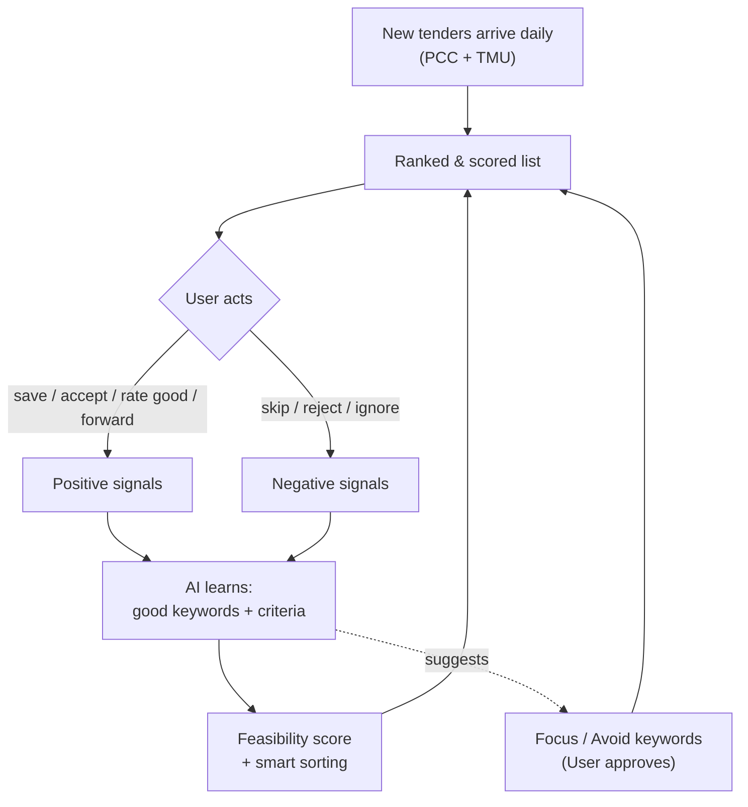
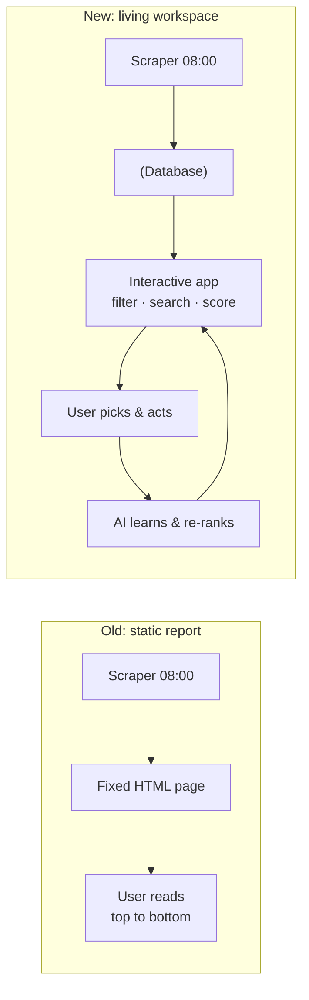
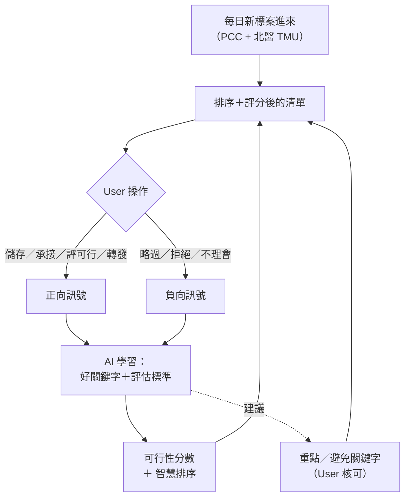
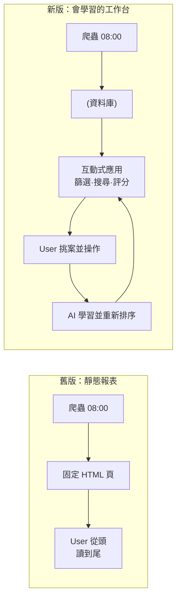

# Tender AI — What's New / 新版說明

---

# 🇬🇧 English

## In one sentence

The old tool **emailed us a fixed daily list of tenders**. The new **Tender AI** turns that into a **living workspace that learns how User picks jobs** — so over time it puts the right tenders at the top and pushes the ones worth bidding.

## Before vs After

| | Old version (today) | New version (Tender AI) |
|---|---|---|
| Format | A static daily report page | A live web app with a database |
| Filtering | Almost none (2 buttons, only on the home page) | Full filters: budget, deadline, city, category, **focus keywords**, **avoid keywords** |
| Sorting | Fixed (by deadline only) | Sort by deadline, budget, potential, or **feasibility score** |
| Search | Basic text match | **Natural-language search** ("Taipei interior jobs around NT$6M, 2+ weeks left") |
| Memory | Forgets everything daily | Remembers what User saved, rated, accepted, and why |
| AI help | None | **Feasibility score + reason** on each tender; auto-summary of tender documents |
| Access | Public link only | Secure login; colleagues can view remotely in real time |
| Gets smarter? | No | **Yes — it learns from how User works** |

## What you can now do (features & experience)

- **Find the right jobs fast** — combine filters (budget range, deadline window, city, work type) and the list updates instantly, with a live "N results" count.
- **Don't waste time on the wrong ones** — set **avoid keywords** so irrelevant tenders disappear automatically.
- **One-click actions on each tender** — save ⭐, forward to a colleague, mark progress (watching / bidding / submitted / won / dropped), give a 1–5 rating, and **"Accept"** a job to take it on.
- **Ask in plain language** — the search understands normal sentences, not just exact words.
- **Let the AI do the reading** — each tender gets an auto-summary (budget, deadline, qualifications, scope) and a **feasibility score** with a short reason.
- **See it anywhere** — secure remote access for colleagues and management.

## How the AI learns User's habits

The core idea: **every action User takes is a lesson.** When he saves, accepts, or rates a tender "feasible," the system learns what a good job looks like. When he skips or rejects one, it learns what to avoid. It then uses those lessons to score and re-order tomorrow's list — and to suggest new **focus / avoid keywords** for User to approve.

A person always stays in control: the AI **suggests**, User **decides**. Suggestions only become rules when he approves them.

## Old vs new — the daily flow

## Why it matters (for the team & management)

- **Less time hunting, more time bidding** — the best opportunities surface first.
- **Fewer missed jobs** — feasible tenders get pushed, not buried.
- **Knowledge stays in the company** — User's judgment becomes a company asset, not something locked in one person's head.
- **Everyone sees the same picture** — remote, real-time, one source of truth.

## Roadmap at a glance

1. Database + import history → 2. Capture User's actions → 3. AI search & summaries → 4. Learn keywords → 5. Feasibility scoring & smart sorting.

---

# 🇹🇼 繁體中文

## 一句話說明

舊工具**每天寄來一份固定的標案清單**；新版 **Tender AI** 把它變成一個**會學習 User 怎麼挑案的工作台**——時間久了，它會自動把對的標案排到最前面、把值得投標的案件推播出來。

## 新舊版差異對照

| | 舊版（目前） | 新版（Tender AI） |
|---|---|---|
| 形式 | 每日一張靜態報表頁 | 有資料庫的動態網頁應用 |
| 篩選 | 幾乎沒有（只有 2 顆按鈕、且只在首頁） | 完整篩選：預算、截止、城市、類別、**重點關鍵字**、**避免關鍵字** |
| 排序 | 固定（只依截止日） | 可依截止日、預算、潛力、**可行性分數**排序 |
| 搜尋 | 基本文字比對 | **自然語言搜尋**（如「台北、室內裝修、600 萬上下、還有兩週以上」） |
| 記憶 | 每天歸零、不記任何事 | 記得 User 儲存、評分、承接了什麼、以及理由 |
| AI 協助 | 無 | 每筆標案有**可行性分數 + 理由**；招標文件**自動摘要** |
| 存取 | 只有公開連結 | 安全登入；同事可遠端即時查看 |
| 會變聰明嗎？ | 不會 | **會——它從 User 的操作中學習** |

## 你現在可以做什麼（功能與體驗）

- **快速找到對的案**：組合篩選（預算區間、截止窗、城市、工程類別），清單即時更新並顯示「共 N 筆」。
- **不再浪費時間在不相關的案**：設定**避免關鍵字**，無關標案自動消失。
- **每筆標案一鍵操作**：⭐ 儲存、轉發同事、標進度（觀望／備標中／已投／得標／放棄）、1–5 星評分、以及一鍵**「承接」**。
- **用講話的方式搜尋**：搜尋看得懂正常句子，不必逐字精準。
- **讓 AI 幫你讀文件**：每筆自動摘要（預算、截止、資格、範圍）並附**可行性分數**與簡短理由。
- **隨處可看**：同事與主管可安全遠端存取。

## AI 如何學習 User 的習慣

核心觀念：**User 的每個動作都是一堂課。** 當他儲存、承接、或評為「可行」，系統就學到「好案長什麼樣」；當他略過或拒絕，就學到「該避開什麼」。接著用這些學習去為隔天的清單評分、重新排序，並主動建議新的**重點／避免關鍵字**讓 User 核可。

人永遠在掌控之中：AI 只負責**建議**，User 負責**決定**；建議要經他核可才會變成規則。

## 新舊每日流程對照

## 為什麼重要（對團隊與主管）

- **少花時間找案、多花時間投標**：最好的機會自動浮到最前面。
- **更少漏掉好案**：可行的標案被推播，而不是被埋沒。
- **知識留在公司**：User 的判斷力沉澱為公司資產，不再只鎖在一個人腦中。
- **大家看到同一份真相**：遠端、即時、單一來源。

## 開發藍圖一覽

1. 建資料庫＋匯入歷史 → 2. 捕捉 User 的操作 → 3. AI 搜尋與摘要 → 4. 學習關鍵字 → 5. 可行性評分與智慧排序。

---

*配套技術文件：`PRD.md`、`design-handoff-claude-design.md`、`規劃-後台資料庫與RAG學習迴圈.md`（同資料夾）。*
